# 🏠 Personal Server

[](https://nestjs.com/)
[](https://reactjs.org/)
[](https://www.postgresql.org/)
[](https://www.docker.com/)
[](https://www.typescriptlang.org/)

> A self-hosted personal data aggregation platform that consolidates your fitness, music, habits, and financial data into a unified dashboard.

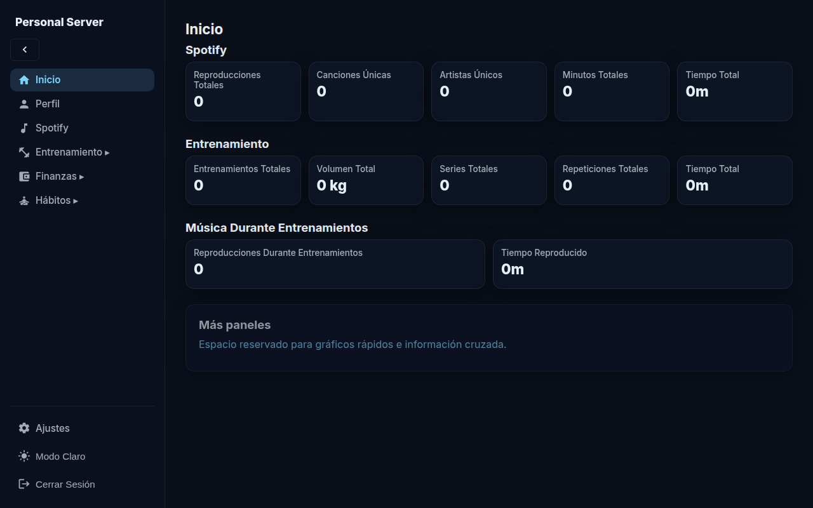

---

## ✨ Features

### 🏋️ Workout Tracking
- Import data from **FitNotes** (SQLite)
- Track workout sessions, exercises, sets, and reps
- Monitor bodyweight over time
- Create and manage workout routines
- Categories and exercise library management

### 🎵 Music Analytics
- **Spotify integration** with OAuth linking
- Track listening history and streams
- View top tracks, artists, and albums
- Analytics per day/hour with customizable timeframes
- Global and personal statistics

### 📊 Habits Tracking
- Import data from **HabitShare** (CSV)
- Track daily habits with success/fail/skip status
- Streak calculations (current and longest)
- Calendar view by month
- Success rate statistics

### 💰 Finance Tracking
- Import data from **Cashew** (JSON export)
- Track transactions across multiple wallets
- Categorize expenses and income
- **Transaction types**: Income (green), Expenses (red), Transfers (blue)
- Type filter in transactions view
- Support for multiple currencies

### 📈 Cross-Domain Dashboard
- Correlate Spotify listening during workouts
- Unified timeline view
- Multi-domain analytics

### 🤖 Agent API
- RESTful API (v1) for AI assistants and external integrations
- API key authentication with scoped permissions
- Full access to workout, habits, and finance data
- MCP-compatible endpoints

### 🌐 Multi-Language Support (i18n)
- **English** and **Spanish** fully supported
- Language switcher in Settings → Preferences
- Persists user preference in localStorage
- Easy to add new translations

### ⚙️ Settings Page
- **Agent API Keys**: Create, edit, and revoke API keys for AI assistants
- **Scopes**: Fine-grained permissions per module (workout, finance, habits, music, etc.)
- **Connections**: View and manage connected services
- **Preferences**: Language selection and more

### 🔐 Security
- JWT-based authentication
- Multi-factor authentication (MFA/TOTP)
- Multi-user support with account segregation
- Per-account data isolation
- Agent API keys with granular scopes

---

## 🛠️ Tech Stack

### Backend
| Technology | Purpose |
|------------|---------|
| **NestJS 9** | Node.js framework |
| **TypeORM** | Database ORM |
| **PostgreSQL 16** | Primary database |
| **Redis 7** | Caching & job queues |
| **Socket.IO** | Real-time communication |
| **Swagger/OpenAPI** | API documentation |

### Frontend
| Technology | Purpose |
|------------|---------|
| **React 18** | UI framework |
| **Vite 5** | Build tool |
| **React Router 6** | Client-side routing |
| **Chart.js** | Data visualization |
| **Socket.IO Client** | Real-time updates |

### Infrastructure
| Technology | Purpose |
|------------|---------|
| **Docker Compose** | Container orchestration |
| **Apache Airflow** | Workflow automation |
| **Nginx** | Frontend serving (production) |

---

## 🚀 Quick Start

### Prerequisites

- **Node.js** 22.x
- **Docker** and **Docker Compose**
- **pnpm** or **npm**

### Development Setup

1. **Clone the repository**
   ```bash
   git clone https://github.com/yourusername/Personal-Server.git
   cd Personal-Server
   ```

2. **Start infrastructure services**
   ```bash
   docker-compose up -d postgres redis
   ```

3. **Setup the backend**
   ```bash
   cd backend
   cp .env.example .env.dev
   # Edit .env.dev with your configuration
   npm install
   npm run typeorm:migrate:run
   npm run start:dev
   ```

4. **Setup the frontend**
   ```bash
   cd frontend
   npm install
   npm run dev
   ```

5. **Access the application**
   - Frontend: http://localhost:5173
   - Backend API: http://localhost:3000
   - Swagger Docs: http://localhost:3000/api

### Production Deployment

```bash
# Build and start all services
docker-compose up -d

# Access
# Frontend: http://localhost:80
# Backend: http://localhost:3000
# Airflow: http://localhost:8080 (admin/admin)
```

---

## 📁 Project Structure

```
Personal-Server/
├── backend/                 # NestJS API server
│   ├── src/
│   │   ├── system/          # Auth, accounts, Spotify OAuth
│   │   ├── music/           # Music/streaming module
│   │   ├── workout/         # Workout tracking module
│   │   ├── habits/          # Habits tracking module
│   │   ├── finance/         # Finance/transaction tracking
│   │   ├── agents/          # Agent API authentication
│   │   ├── api/v1/          # Versioned API for agents
│   │   ├── dashboard/       # Cross-domain analytics
│   │   └── migrations/      # TypeORM migrations
│   └── Dockerfile
├── frontend/                # React SPA
│   ├── src/
│   │   ├── components/      # Shared components
│   │   ├── pages/           # Route pages
│   │   └── contexts/        # React contexts
│   └── Dockerfile
├── airflow/                 # Airflow DAGs and config
├── initdb/                  # Database initialization scripts
├── docs/                    # Documentation
│   ├── ARCHITECTURE.md
│   ├── API.md
│   └── DEVELOPMENT.md
└── docker-compose.yml
```

---

## 📖 Documentation

- **[Architecture](docs/ARCHITECTURE.md)** - System design and module structure
- **[API Reference](docs/API.md)** - Complete API documentation
- **[Development Guide](docs/DEVELOPMENT.md)** - Setup and contribution guide

---

## 🗺️ Roadmap

### ✅ Completed
- [x] Workout module with FitNotes import
- [x] Music module with Spotify integration
- [x] Habits module with HabitShare import
- [x] Finance module with Cashew import
- [x] Agent API (MCP + REST) for AI assistants

### 🚧 In Progress
- [ ] Enhanced FitNotes import UX
- [ ] Mobile-responsive dashboard

---

## 📷 Screenshots

> All screenshots shown in **Spanish** to demonstrate the i18n feature. The app supports English and Spanish.

### 🏠 Main Dashboard
Unified home view with Spotify listening stats, workout metrics, and cross-domain analytics.


### 🏋️ Workout Module
Track workouts, manage exercises, view history, and monitor bodyweight over time.

| Dashboard | History | Exercises |
|:---------:|:-------:|:---------:|
| 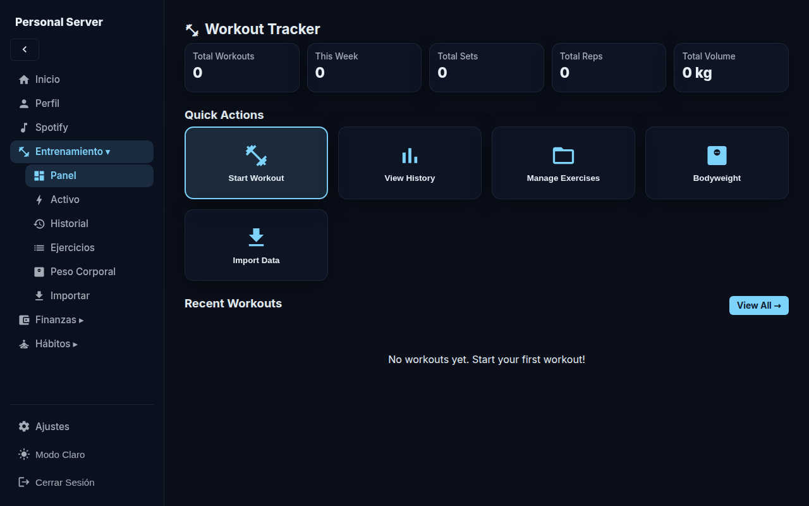 | 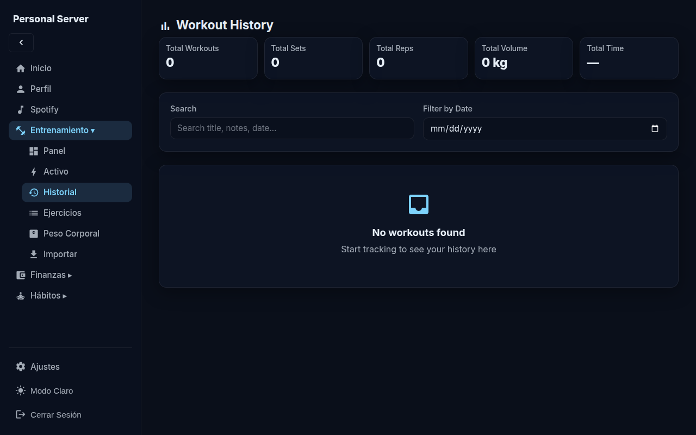 | 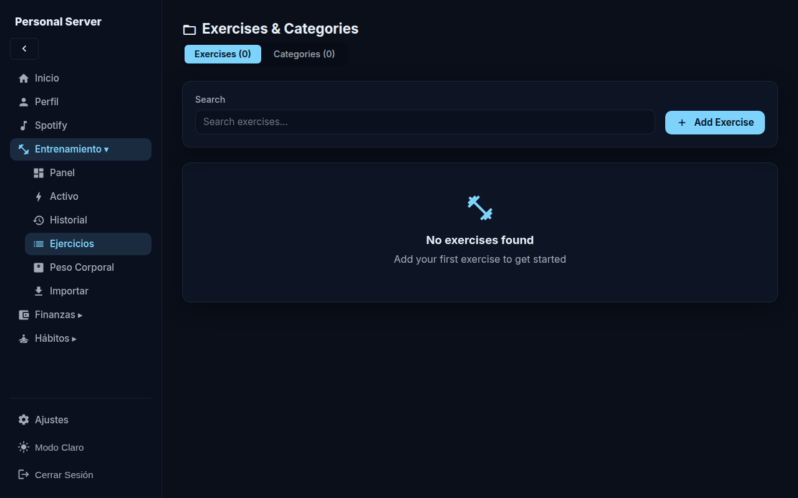 |

### 🎵 Spotify Integration
Link your Spotify account to track listening history and correlate with workouts.

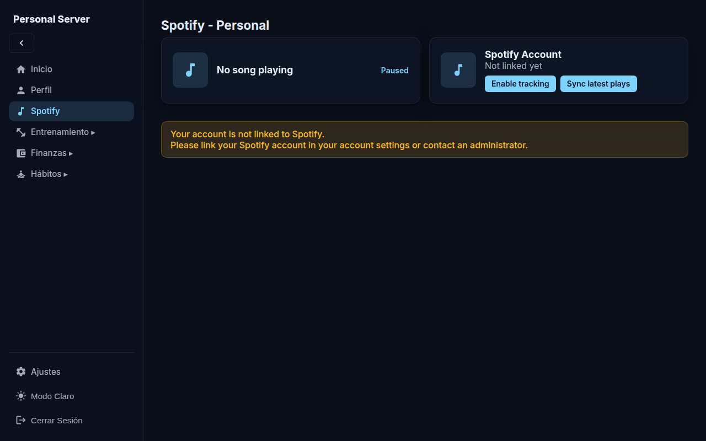

### 💰 Finance Module
Track income (green ↓) and expenses (red ↑), manage wallets, and filter transactions by type.

| Dashboard | Transactions | Wallets |
|:---------:|:------------:|:-------:|
| 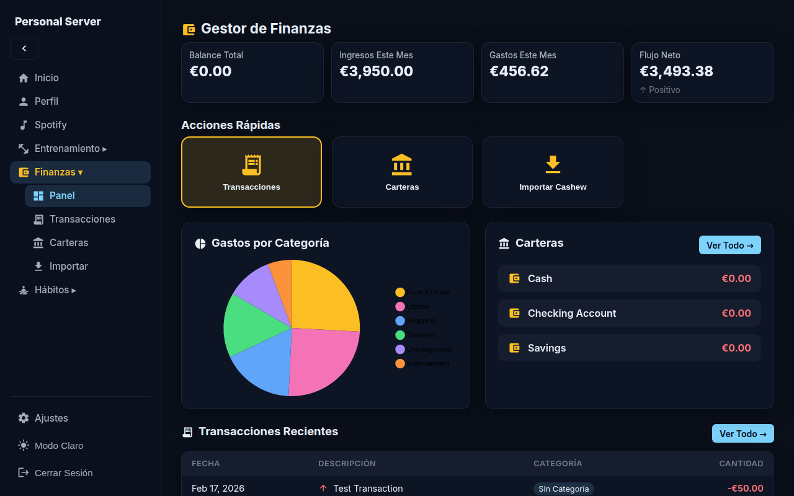 | 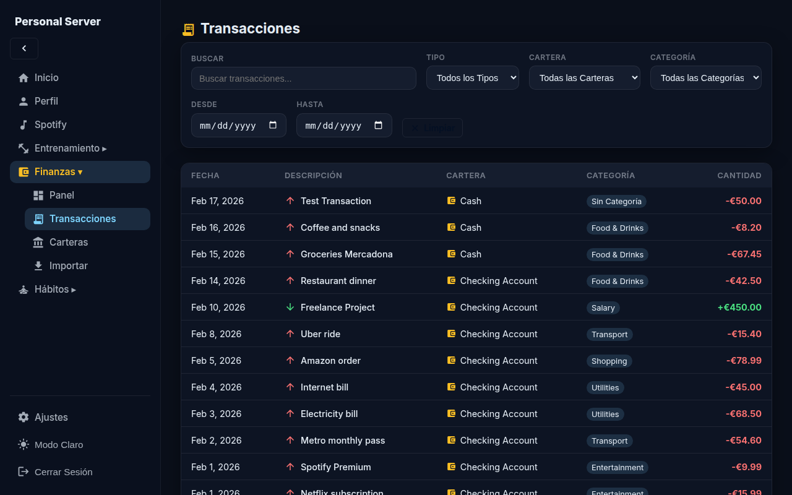 | 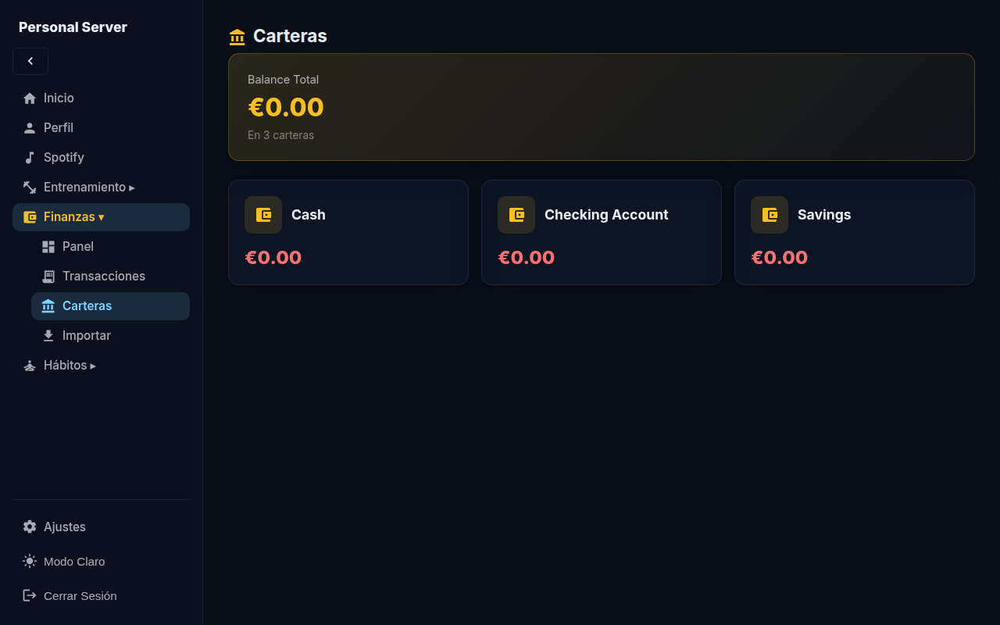 |

### 📊 Habits Tracker
Track daily habits, view streaks, success rates, and calendar history. Import from HabitShare.

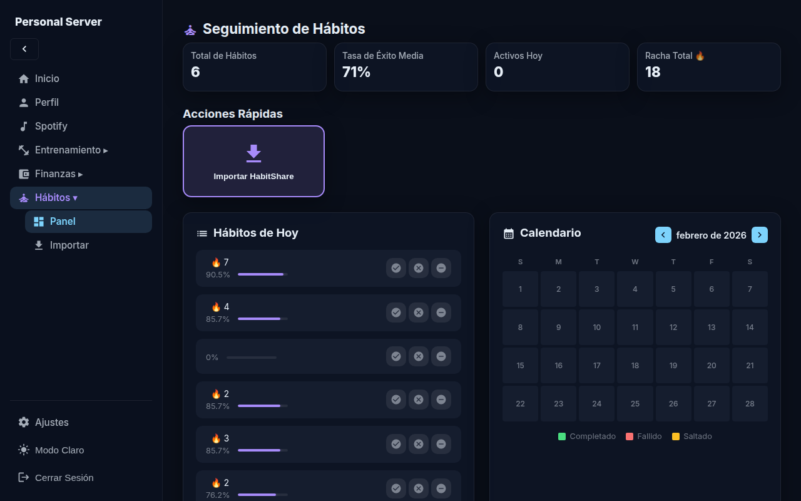

### ⚙️ Settings Page
Manage Agent API Keys, connections, and preferences including language selection.

| API Keys | Preferences (Language) |
|:--------:|:----------------------:|
| 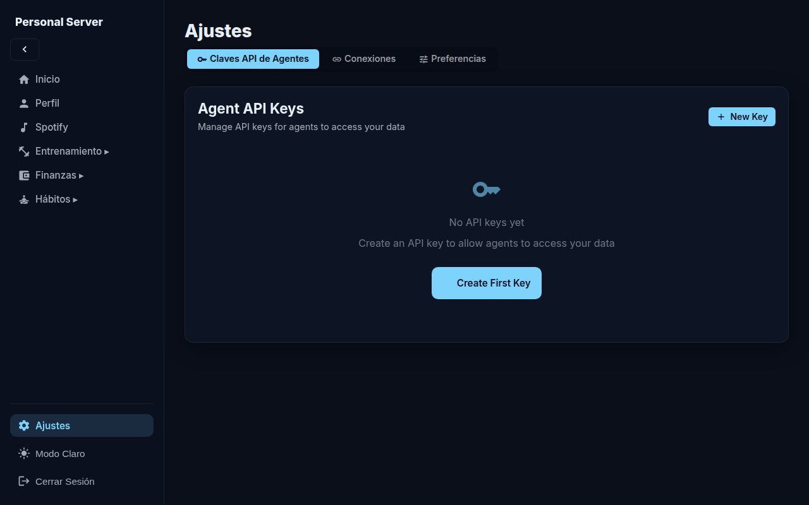 | 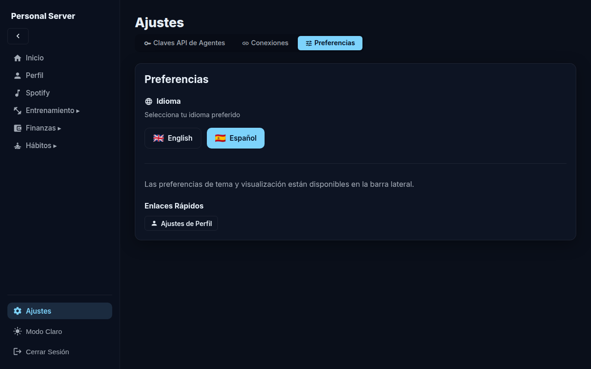 |

### 🔐 Profile
Manage your account, MFA settings, and connected services.

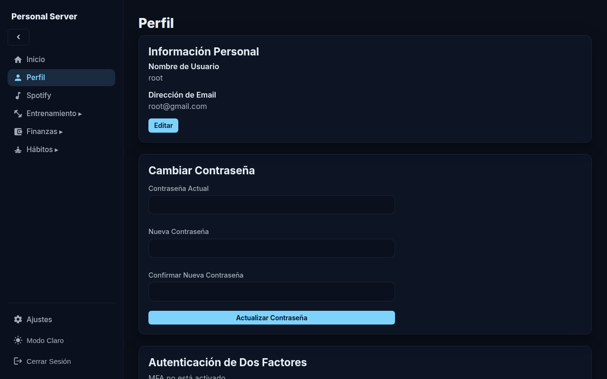

---

## 📄 License

This project is private and proprietary.

---

## 🤝 Contributing

This is a personal project. For issues or suggestions, please open an issue.

---

Built with ❤️ for personal data ownership
